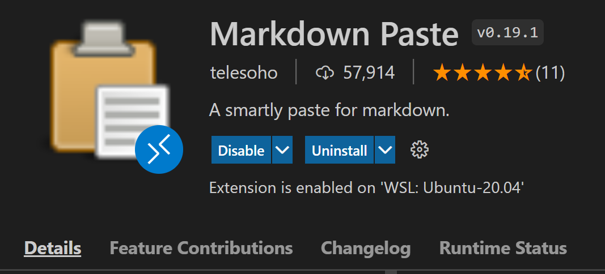
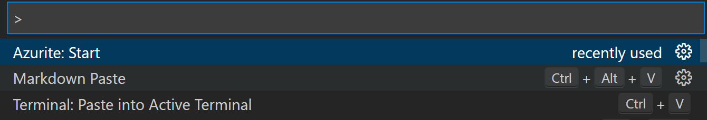

# playwithk8s

Um bilder einfügen zu können, kann die Extension

  

verwendet werden. 

Man kann dann Screenshots einfach mit CTRL+ALT+V

  

in eine .md Datei einfügen. 

Coole Sache!!!

#

kubectl get pods

